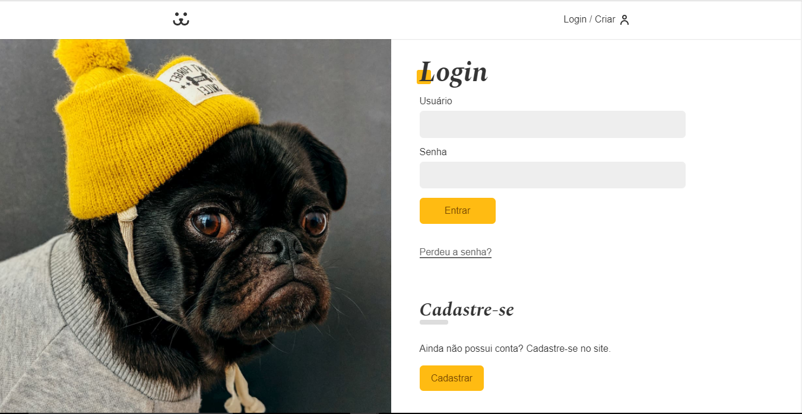
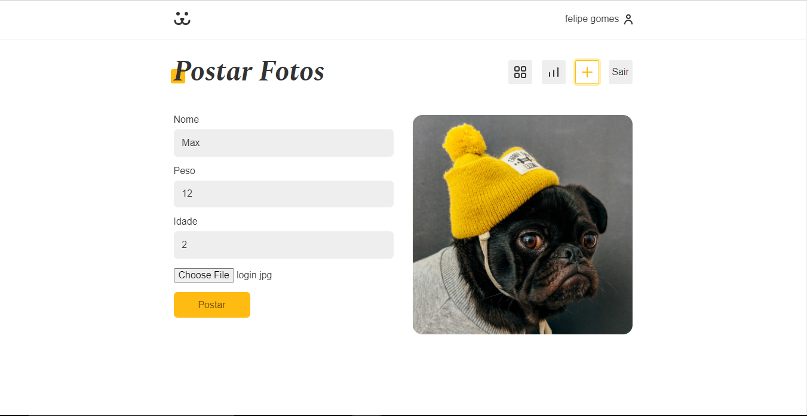
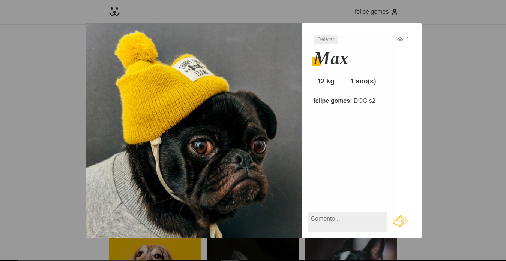
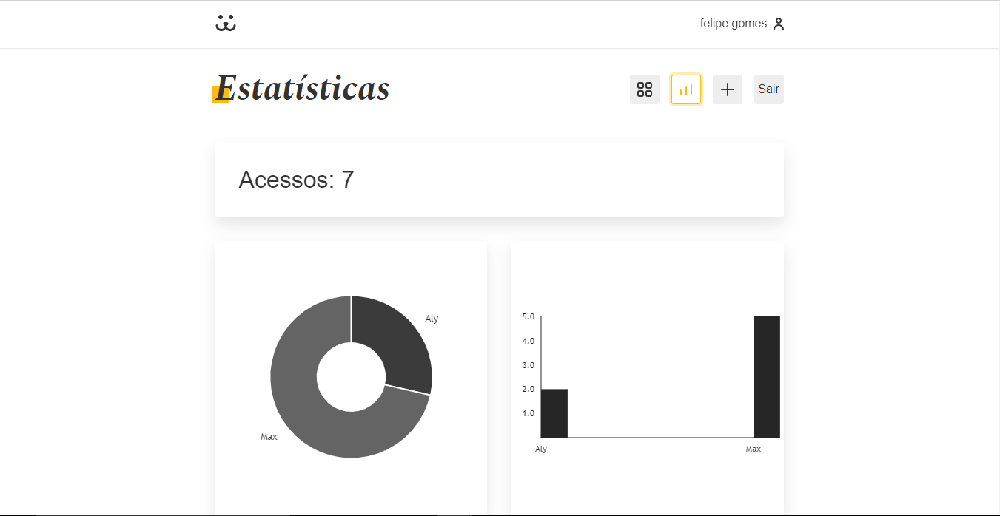

# Dogs
O projeto Dogs foi desenvolvido com __**ReactJS**__ para ser uma rede social totalmente funcional, onde pessoas postam fotos dos cachorros.
<a href="https://dogs-97719.web.app/">LINK DO PÁGINA DO PROJETO</a>

# API
O projeto usa uma API real desenvolvida no WordPress. Com ela é possivel pegar todos os dados necessários para criar a aplicação.

# Autenticação de usuário
O projeto possui uma área de login e criação de usuário totalmente funcional, permitindo até mesmo recuperação de senhas.



# Postagem de fotos e comentários
Não seria uma rede social se as pessoas não pudessem socializar, certo? Em Dogs você pode postar as suas fotos e deletá-las se você for o autor da postagem, assim como comentar em qualquer foto.





# Gráficos de acesso
O site ainda conta com estatísticas de acesso que mostram qual o total de acessos um usuário possui, e quais as fotos mais vistas desse usuário.



# Iniciando o projeto
O projeto foi criado utilizando create-react-app boilerplate e utiliza somente uma biblioteca externa, sendo ela o Victory, que é responsável pela geração dos gráficos do parte de estatísticas do site. Para baixar todas as dependências:

```
npm install
```

Para instalar somente o Victory:
```
npm i --save victory
```

